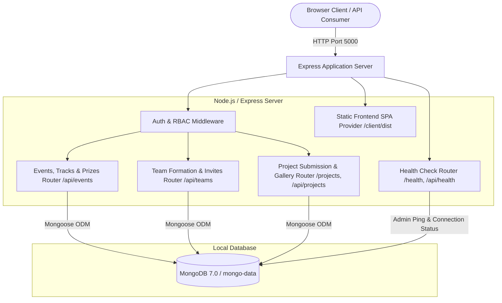
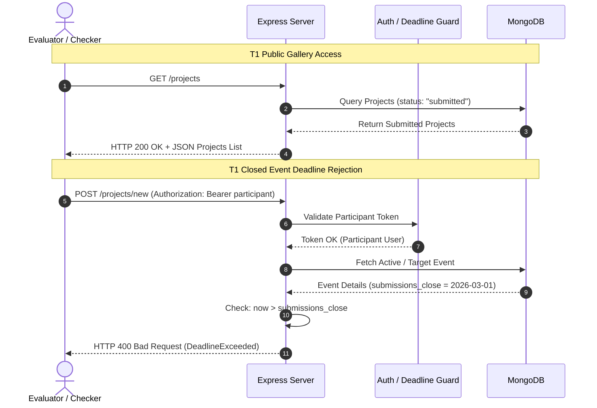

# HackHub — Architecture & System Design

HackHub is an offline-first, self-hostable hackathon management platform engineered to run with zero cloud or third-party API dependencies. It adheres strictly to the **DOGFOOD 2026** platform specification.

---

## 1. High-Level Architecture Overview

HackHub uses a decoupled client-server architecture built entirely on open-source technologies:
- **Frontend SPA:** React 18, Vite build toolchain, Vanilla CSS design system.
- **Backend API:** Node.js (v18+) with Express.js routing and middleware pipeline.
- **Database:** Local MongoDB instance accessed via Mongoose ODM.
- **Testing & Quality Assurance:** Jest + Supertest + `mongodb-memory-server` for 100% offline verification.
- **Packaging:** Multi-stage Docker containerization running via Docker Compose.

---

## 2. Major Components

### 2.1 Backend Core (`server/src/`)
- **[app.js](file:///c:/Users/aishw/DogFoodHack/hack-hub/server/src/app.js)**: Configures Express middleware (CORS, JSON body parsing, request logging), API routes, and serves production React assets from `client/dist`.
- **[index.js](file:///c:/Users/aishw/DogFoodHack/hack-hub/server/src/index.js)**: Handles deterministic application startup, verifies database connectivity, triggers fixture auto-seeding if empty, and manages graceful shutdowns on `SIGINT` / `SIGTERM`.
- **[connection.js](file:///c:/Users/aishw/DogFoodHack/hack-hub/server/src/db/connection.js)**: Manages MongoDB connection lifecycle, auto-reconnects, and status diagnostics (`getDBStatus`).
- **[seed.js](file:///c:/Users/aishw/DogFoodHack/hack-hub/server/src/db/seed.js)**: Bootstraps the platform using `fixtures.json`, creates long-lived authentication sessions for test identities (`organizer`, `judge_a`, `judge_b`, `participant`), and seeds fixture events and projects.

### 2.2 Middleware & Security (`server/src/middleware/`)
- **`auth.middleware.js`**: Enforces session token validity. Extracts Bearer or raw tokens from the `Authorization` or `x-session-token` headers and loads the authenticated user.
- **`role.middleware.js`**: Enforces strict Role-Based Access Control (RBAC) across four roles: `admin`, `organizer`, `judge`, and `participant`.

### 2.3 Frontend Client (`client/src/`)
- **Single Page Application (SPA)**: Built with React 18, employing component-level state and URL hash routing (`#hackathons`, `#projects`, `#dashboard`, `#admin/developer`).
- **Responsive Theme & UI**: Modern dark-mode interface with glassmorphic cards, responsive metric grids, accessible color contrast, and micro-animations.
- **Diagnostics & Testing Suite**: Includes interactive test harnesses ([DeveloperDiagnosticsView.jsx](file:///c:/Users/aishw/DogFoodHack/hack-hub/client/src/views/DeveloperDiagnosticsView.jsx)) to verify health, gallery, auth, events, teams, and projects directly from the browser.

---

## 3. Communication & Data Flow

---

## 4. Key Design Decisions

1. **Zero External Dependencies**:
   - Authentication is implemented via an internal database session store (`Session` model) rather than third-party SaaS auth (Auth0, Clerk, Firebase).
   - Test suites leverage `mongodb-memory-server` to run 100% offline without requiring internet access or a running external database daemon.

2. **Server-Side Deadline Enforcement**:
   - Deadline validation is strictly enforced on the server before database mutation. Even if client-side checks are bypassed, late project submissions or creations are rejected with HTTP 4xx.

3. **Deterministic Seed & Auto-Bootstrapping**:
   - The application automatically detects an unseeded database on startup and seeds standard fixtures (`fixtures.json`), ensuring `docker compose up` starts immediately in an evaluated, operational state.

4. **Multi-Stage Containerization**:
   - The [Dockerfile](file:///c:/Users/aishw/DogFoodHack/hack-hub/Dockerfile) compiles the Vite frontend in Stage 1 and bundles only production runtime dependencies with Express in Stage 2, resulting in a lightweight, self-contained container.
