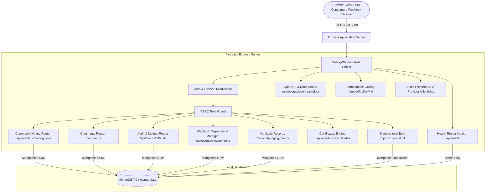
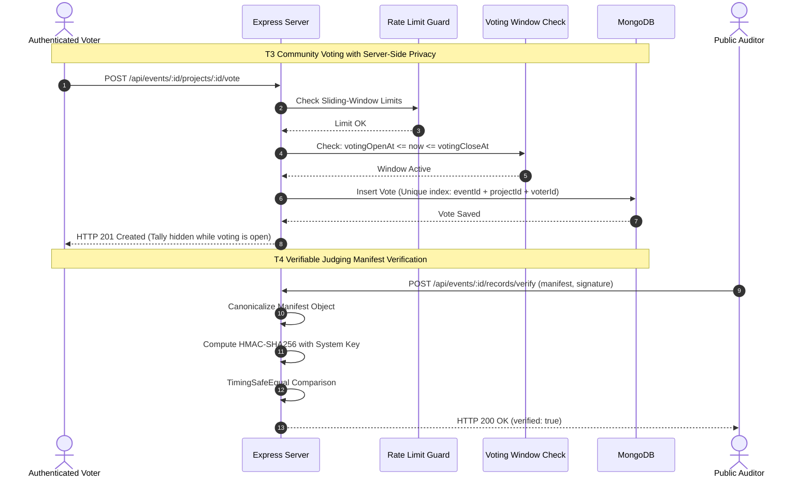

# HackHub — Architecture & System Design

HackHub is an offline-first, self-hostable hackathon management platform engineered to run with zero cloud or third-party API dependencies. It adheres strictly to the **DOGFOOD 2026** platform specification.

---

## 1. High-Level Architecture Overview

HackHub uses a decoupled client-server architecture built entirely on open-source technologies:
- **Frontend SPA:** React 18, Vite build toolchain, Vanilla CSS design system.
- **Backend API:** Node.js (v18+) with Express.js routing and middleware pipeline.
- **Database:** Local MongoDB instance accessed via Mongoose ODM.
- **Testing & Quality Assurance:** Jest + Supertest + `mongodb-memory-server` for 100% offline verification.
- **Packaging:** Multi-stage Docker containerization running via Docker Compose.

---

## 2. Major Subsystems & Modules

### 2.1 Backend Subsystems (`server/src/`)
- **[app.js](file:///c:/Users/aishw/DogFoodHack/hack-hub/server/src/app.js)**: Configures Express middleware, security headers, rate limiting, and mounts all REST, OpenAPI, Embed, and Static routes.
- **[voting.controller.js](file:///c:/Users/aishw/DogFoodHack/hack-hub/server/src/controllers/voting.controller.js)**: Manages voting window validation, vote casting/retraction, duplicate prevention via compound DB unique index, server-side tally privacy during open voting, and Mulberry32 PRNG randomized project ordering.
- **[comment.controller.js](file:///c:/Users/aishw/DogFoodHack/hack-hub/server/src/controllers/comment.controller.js)**: Manages project comments, length boundaries, HTML/script sanitization against XSS, author deletion, and organizer/admin moderation.
- **[rate-limit.middleware.js](file:///c:/Users/aishw/DogFoodHack/hack-hub/server/src/middleware/rate-limit.middleware.js)**: In-memory sliding-window rate limiter returning HTTP `429 Too Many Requests` with `Retry-After` headers.
- **[audit.controller.js](file:///c:/Users/aishw/DogFoodHack/hack-hub/server/src/controllers/audit.controller.js)**: Records security and participation audit logs (`vote.created`, `duplicate_vote.rejected`, `comment.created`, etc.) and delivers organizer analytics.
- **[openapi.controller.js](file:///c:/Users/aishw/DogFoodHack/hack-hub/server/src/controllers/openapi.controller.js)**: Serves full OpenAPI 3.0 specification (`/api/openapi.json`) and renders an offline-ready interactive documentation UI (`/api/docs`).
- **[webhook.service.js](file:///c:/Users/aishw/DogFoodHack/hack-hub/server/src/services/webhook.service.js)**: Dispatches signed HTTP POST payloads with `X-HackHub-Signature` (`HMAC-SHA256`) and handles bounded retry attempts.
- **[record.controller.js](file:///c:/Users/aishw/DogFoodHack/hack-hub/server/src/controllers/record.controller.js)**: Generates verifiable judging record manifests with deep canonicalization and anonymized judge pseudonyms (`JDG-XXXXXXXX`), and provides cryptographic verification.
- **[certificate.controller.js](file:///c:/Users/aishw/DogFoodHack/hack-hub/server/src/controllers/certificate.controller.js)**: Issues verifiable participation, winner, and judge certificates with SHA-256 integrity hashes in JSON or printable HTML.
- **[embed.controller.js](file:///c:/Users/aishw/DogFoodHack/hack-hub/server/src/controllers/embed.controller.js)**: Delivers an embeddable, standalone HTML iframe gallery and an open CORS JSON API for external widgets.
- **[bulk.controller.js](file:///c:/Users/aishw/DogFoodHack/hack-hub/server/src/controllers/bulk.controller.js)**: Executes transactional bulk imports with all-or-nothing validation, plus JSON and CSV exports.

---

## 3. Communication & Data Flow

---

## 4. Key Design Decisions

1. **Zero External Dependencies**:
   - Authentication is implemented via an internal database session store (`Session` model) rather than third-party SaaS auth (Auth0, Clerk, Firebase).
   - Test suites leverage `mongodb-memory-server` to run 100% offline without requiring internet access or a running external database daemon.

2. **Server-Side Deadline & Tally Enforcement**:
   - Voting tallies and rank orders are strictly hidden server-side from non-staff participants while voting is active, preventing vote bandwagons or early leakages.
   - Project submission deadlines and voting windows are enforced before any DB mutation.

3. **Cryptographic Integrity & Privacy**:
   - Judging manifests are digitally signed using HMAC-SHA256 after deep JSON canonicalization.
   - Individual judge identities are anonymized to pseudonyms (`JDG-XXXXXXXX`), protecting judge privacy while ensuring public auditability.

4. **Multi-Stage Containerization**:
   - The [Dockerfile](file:///c:/Users/aishw/DogFoodHack/hack-hub/Dockerfile) compiles the Vite frontend in Stage 1 and bundles only production runtime dependencies with Express in Stage 2, resulting in a lightweight, self-contained container.
