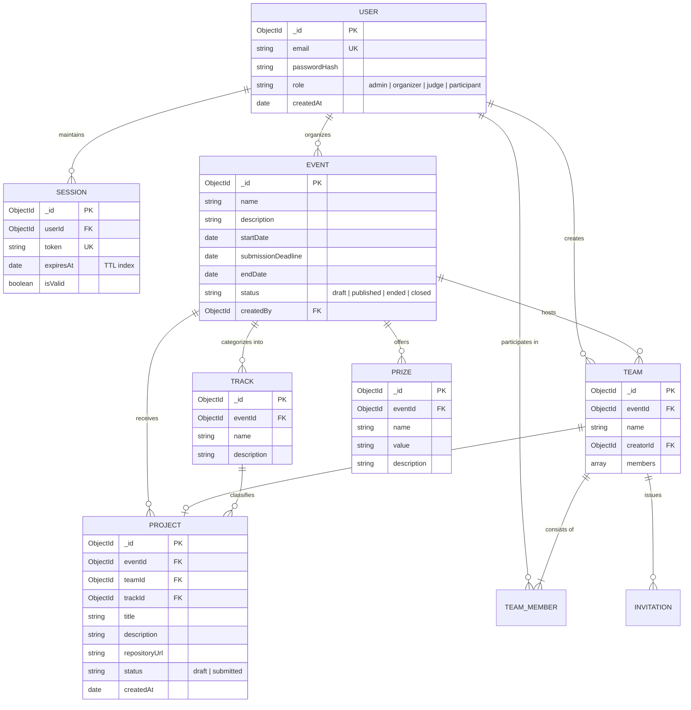

# HackHub — Data Model & Schema Specification

This document details the database architecture, entity schemas, relationships, fixture loading mechanisms, and data ingestion/export pipelines in **HackHub**.

---

## 1. Entity Relationship Diagram (ERD)

---

## 2. Core Entities & Schema Details

### 2.1 User (`User`)
- **Collection**: `users`
- **Fields**:
  - `email`: (String, unique, lowercase, required)
  - `password`: (String, bcrypt-hashed, min length 6)
  - `role`: (Enum: `admin`, `organizer`, `judge`, `participant`, default: `participant`)
  - `createdAt`, `updatedAt`: (Timestamps)

### 2.2 Session (`Session`)
- **Collection**: `sessions`
- **Fields**:
  - `userId`: (ObjectId ref `User`, required, indexed)
  - `token`: (String, unique, 64-char hex or deterministic test key)
  - `expiresAt`: (Date, indexed with MongoDB automatic TTL `expireAfterSeconds: 0`)
  - `isValid`: (Boolean, indexed)

### 2.3 Event (`Event`)
- **Collection**: `events`
- **Fields**:
  - `name`: (String, required, min 3 chars)
  - `description`: (String, optional)
  - `startDate`: (Date, required)
  - `submissionDeadline`: (Date, required — verified `startDate < submissionDeadline <= endDate`)
  - `endDate`: (Date, required)
  - `status`: (Enum: `draft`, `published`, `ended`, `closed`)
  - `createdBy`: (ObjectId ref `User`)

### 2.4 Track & Prize (`Track`, `Prize`)
- **Collection**: `tracks`, `prizes`
- Track associates a submission category with an Event.
- Prize associates an award title, dollar/token value, and description with an Event.

### 2.5 Team & Invitation (`Team`, `Invitation`)
- **Collection**: `teams`, `invitations`
- A Team belongs to an Event and is created by a Participant.
- `members` contains an array of `{ userId, role: 'owner' | 'member', joinedAt }`.
- Invitations generate tokenized join requests.

### 2.6 Project (`Project`)
- **Collection**: `projects`
- **Fields**:
  - `eventId`: (ObjectId ref `Event`, required)
  - `teamId`: (ObjectId ref `Team`, required, one project per team per event)
  - `trackId`: (ObjectId ref `Track`, required)
  - `title`: (String, required, min 2 chars)
  - `description`: (String)
  - `repositoryUrl`: (String)
  - `status`: (Enum: `draft`, `submitted`)
  - `createdAt`, `updatedAt`: (Timestamps)

---

## 3. Fixture Data Loading (`fixtures.json`)

The platform loads official benchmark data from `fixtures.json` located at the repository root:
1. `seedDatabase()` parses `fixtures.json` during build, test, or initial server startup.
2. The fixture event is seeded with `submissions_close = "2026-03-01T18:00:00Z"`. Since this timestamp is in the past, the event is initialized in a `closed` state to test deadline rejection.
3. Test identities (`organizer`, `judge_a`, `judge_b`, `participant`) are created with persistent sessions and published auth tokens.
4. Benchmark projects (`HackHub Autonomous Workflow Orchestrator`, `Visionary Defect Inspector`) are seeded with `submitted` status to populate the public gallery.

---

## 4. Ingestion & Export Lifecycles

- **Ingestion**:
  - Direct REST JSON endpoints for event creation, team formation, project drafting, and submission.
  - Automatic validation checks for role authorization, object validity, and timeline compliance.
- **Export**:
  - Public Project Gallery: `GET /projects` and `GET /api/projects` (unauthenticated, filtered for submitted projects only).
  - Organizer CSV Export (T2): `GET /api/export.csv` generating comma-separated reports of teams, projects, scores, and rankings.
