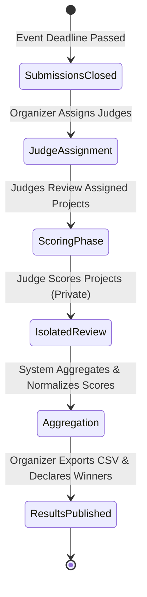

# HackHub — Judging & Evaluation Specification

This document details the judging architecture, assignment workflows, evaluation rubric, scoring isolation, and ranking mechanisms in **HackHub**.

---

## 1. Judging Workflow Overview



---

## 2. Evaluation Rubric & Criteria

Judges evaluate submitted projects across five standardized dimensions on a 1–10 scale:

| Criterion | Weight | Description |
| :--- | :---: | :--- |
| **Technical Innovation & Architecture** | 25% | Novelty of the approach, sound architectural patterns, code quality, and self-hosted reliability. |
| **Execution & Completeness** | 25% | Functionality, adherence to project goals, stability, and lack of critical bugs. |
| **Design, Usability & Polish** | 20% | Visual appeal, responsive interface, clarity of user flows, and accessibility. |
| **Impact & Practicality** | 20% | Real-world problem-solving value, offline utility, and deployment feasibility. |
| **Documentation & Demonstration** | 10% | Clear README, architecture diagrams, data models, and video demonstration. |

---

## 3. Judge Assignment & Security Isolation

- **Role Authorization**: Only users with the `judge` role (e.g., `judge_a`, `judge_b`) can access scoring dashboards and submit evaluation scores.
- **Strict Peer Isolation**:
  - A judge can only query and view their own evaluations (`GET /api/judge/scores`).
  - Attempting to inspect another judge's score sheet (`GET /api/judge/scores?judge=judge_a` from `judge_b`) is blocked server-side by backend authorization middleware, returning **HTTP 401 or 403 Forbidden**.
  - Participants attempting to view judge scores are strictly blocked (**HTTP 401 or 403 Forbidden**).

---

## 4. Score Normalization & Aggregation

To eliminate scoring biases across lenient vs. strict judges, HackHub supports standard score normalization:
1. **Z-Score Normalization**:
   $$Z = \frac{X - \mu}{\sigma}$$
   Transforms raw scores $X$ into standard deviation units using each judge's mean $\mu$ and standard deviation $\sigma$.
2. **Min-Max Scaling**:
   $$Score_{norm} = \frac{Z - Z_{min}}{Z_{max} - Z_{min}} \times 100$$
   Normalizes scores to a consistent 0–100 scale.
3. **Trimmed Mean Ranking**:
   Drops the highest and lowest outlying score for projects with 3 or more judge reviews to prevent score manipulation.

---

## 5. CSV Export & Results Delivery

Organizers can export full scoring sheets and leaderboard rankings via:
```http
GET /api/export.csv
Authorization: Bearer <organizer_token>
```
The endpoint returns:
- Standard `text/csv` format.
- Columns: `Project ID, Project Title, Team Name, Track, Status, Reviews Count, Average Score`.

---

## 6. Verifiable Judging Records & Cryptographic Verification (T4)

To guarantee public trust without compromising judge safety or voting privacy, HackHub introduces cryptographically verifiable judging records:

### 6.1 Manifest Generation (`GET /api/events/:eventId/records/judging`)
- Compiles all project evaluations, criteria breakdowns, and average normalized scores into a canonical manifest.
- **Judge Anonymization**: Individual judge IDs and email addresses are replaced with deterministic 8-character pseudonyms (`JDG-XXXXXXXX`) computed via SHA-256 with the platform system key.
  $$\text{Pseudonym} = \text{JDG-} + \text{SHA256}(\text{judgeId} + \text{systemKey})[0..7]$$
  This prevents targeted harassment or retaliatory bias while ensuring the community can verify that multiple distinct judges evaluated each project.

### 6.2 Cryptographic Signing
- The manifest undergoes recursive canonicalization (sorting all nested object keys deterministically).
- An HMAC-SHA256 signature is calculated across the canonicalized payload using the platform signing key:
  $$\text{Signature} = \text{HMAC-SHA256}(\text{CanonicalizedManifest}, \text{systemSigningKey})$$
- The signature is delivered alongside the manifest in the HTTP response.

### 6.3 Public Verification (`POST /api/events/:eventId/records/verify`)
- Any third-party auditor, participant, or platform can submit the manifest and signature for verification.
- The server re-canonicalizes the manifest, recomputes the HMAC-SHA256 signature, and performs a constant-time `timingSafeEqual` comparison.
- Any modification to scores, ranks, judge counts, or project titles results in immediate rejection (`400 Bad Request`, `verified: false`).

---

## 7. Missing Scores & Reviewer Discrepancy Handling

1. **Missing Reviews**: If a project receives fewer reviews than the target allocation, its ranking is computed using the average of submitted reviews with an explicit `evaluationCount` flag.
2. **Reviewer Discrepancies**: If two judges differ by more than 2.0 on a 5-point scale on the same criterion, the organizer dashboard highlights the evaluation for review prior to certificate issuance or final result publishing.
